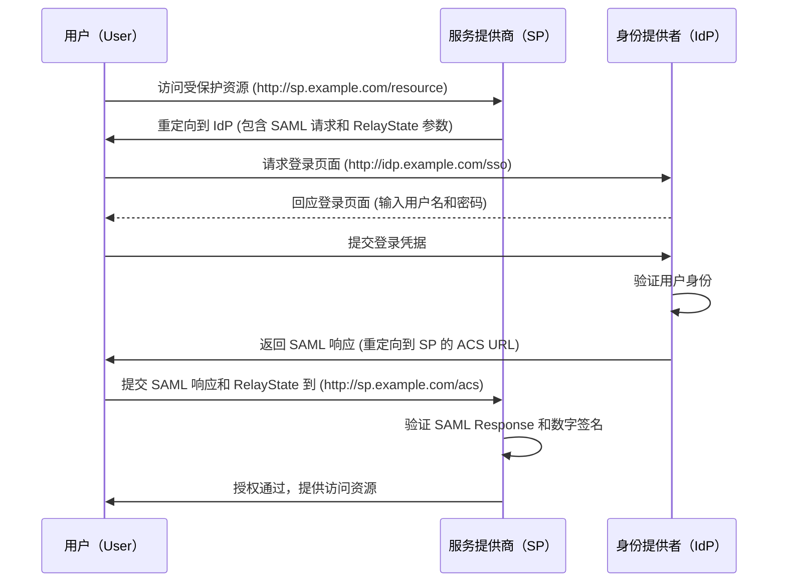

建议先读完 JWT 的文章，再来看这篇文章。

## 认证和授权

单个应用，用户输入用户名和密码，系统验证通过后，就可以访问系统的资源。

但是如果我们开发了多个应用，我们肯定是希望有一种通用的认证机制，这样用户只需要登录一次，就可以访问所有的应用。

好吧这不难，我们可以让所有的应用共享一个数据库，用户登录后，所有的应用都可以访问这个数据库，这样就实现了单点登录。

但是，突然有一天，外部应用想要认证我们的用户，这时候就涉及到了跨应用的认证问题。甚至有些应用想要访问用户的资源，这时候就涉及到了授权问题。

所以这里涉及两个主要课题：认证和授权。

## 行业标准方案

SSO 指的是 Single Sign On，单点登录。用户只需要登陆之后就可以访问所有的应用。

针对 SSO 单点登录问题，有一些行业标准方案：

- SAML 2.0
- Oauth 2.0

针对跨应用的认证问题，SAML 协议(可以实现基于网络跨域的单点登录)是一个解决方案，但是 SAML 太复杂了，而且 XML 格式不利于移动端的传输和解析。

### 术语

- 身份提供者（Identity Provider，IdP）：负责用户认证的系统。
- 服务提供者（Service Provider，SP）：负责提供服务的系统。
- 身份认证（Authentication）：确认用户的身份。
- 授权（Authorization）：确认用户是否有权限访问资源。

### SAML 2.0

SAML 是一种基于 XML 的标准，用于在身份提供者和服务提供者之间交换身份和授权信息。

### Oauth 2.0

[Oauth 2.0](https://oauth.net/2/) 是用于授权的行业标准协议。

关键概念：

Access Token：访问令牌，用于访问资源服务器的令牌。

Refresh Token：刷新令牌，用于刷新 Access Token。

Oauth Scope：权限范围，用于限制 Access Token 的权限。

现代主流的授权协议是 OAuth 2.0 和 OIDC。

OIDC 是基于 OAuth 2.0 的身份认证协议，针对移动互联网进行了优化，它是一个简单的身份层。

OIDC 在令牌上，不仅支持 SAML Assertion，更是支持具有 JSON 格式的 JWT。有了 JWT 加持，OIDC 协议比 SAML 更易于传输和使用。

所以 OAuth 2.0 和 OIDC(OpenID Connect) 出现了。

> OpenID 是 Authentication Layer，OAuth 是 Authorization Layer。
> 前者是认证层，后者是授权层。
> OIDC 是认证和授权的结合。

### 关于 OAuth 2.0

认证除了在一个应用系统内进行，还有一个问题是在不同的应用系统之间进行认证。

比如用户在 A 系统登录后，想要访问 B 系统的资源，这时候就涉及到如何在 A 系统和 B 系统之间传递用户的登录凭证。

但是如果直接传递用户名和密码，就会有很大的安全风险。

所以人们想出了一种授权机制，叫做 OAuth（Open Authorization）。

OAuth 2.0 是一个开放标准，它允许用户授权第三方应用访问他们存储在另外的服务提供者上的信息，而不需要将用户名和密码提供给第三方应用。

OAuth 2.0 的核心思想是授权，而不是认证。最常见的 OAuth 2.0 授权方式是授权码模式（Authorization Code Grant）和密码模式（Resource Owner Password Credentials Grant）。

### 授权码模式

授权码模式是 OAuth 2.0 的标准授权方式，它是一个三方授权的过程：
