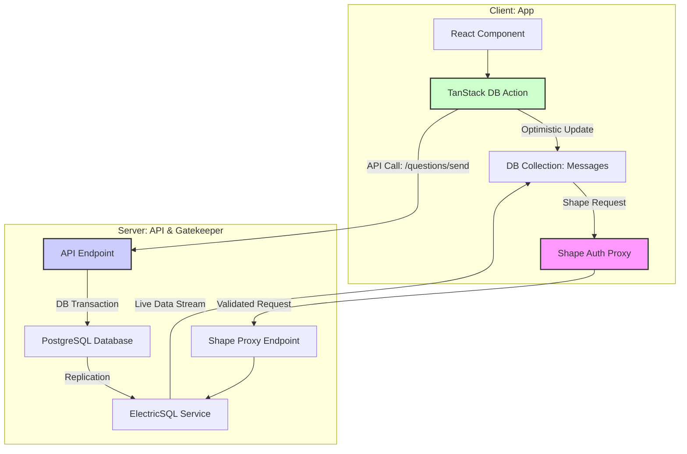
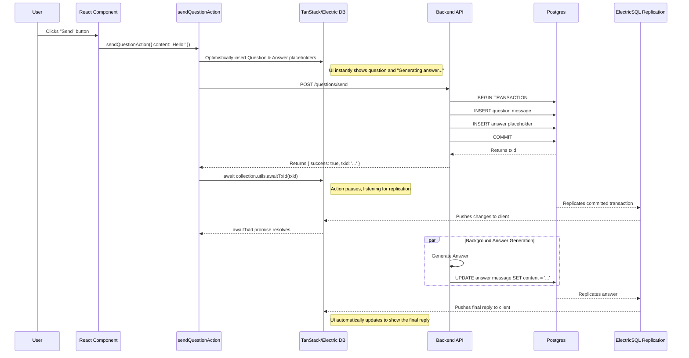

An Integration Guide to TanStack DB & ElectricSQL: Building Real-Time Apps with Optimistic Updates

## Abstract

This document is an in-depth technical guide providing a clear, reusable example of how to combine TanStack DB and ElectricSQL to build modern web applications with **real-time data synchronization**, **secure optimistic updates**, and **transactional consistency**. We will explore the core architecture and best practices through a Q&A application centered around a `messages` table.

> This guide was written based on the following key dependency versions:
> - `@electric-sql/client`: `^1.0.4`
> - `@electric-sql/react`: `^1.0.4`
> - `@tanstack/db`: `^0.0.12`
> - `@tanstack/react-db`: `^0.0.13`
> - `@tanstack/db-collections`: `^0.0.16`

## Architecture Overview

Our Q&A application architecture is divided into a client and a server, communicating via API calls and a real-time data stream. The interaction model of the core components is as follows:



## 1. Foundation: The Shape Gatekeeper Security Model

To securely sync the database to the client in real-time, we cannot expose it directly. ElectricSQL uses the concept of "Shapes" to define subsets of data that a client can subscribe to. Our architecture adds a "Shape Gatekeeper" layer to validate and authorize these data subscription requests.

### 1.1. Dual JWT Authentication

Our authentication system employs a dual JWT model for flexible and secure data access control:

1.  **Auth Token**: A standard JWT used to verify the user's identity, issued by the main authentication service.
2.  **Shape Token**: A short-lived, special-purpose JWT. Before subscribing to a specific data table (a Shape), the client must exchange its valid **Auth Token** for a **Shape Token** from the backend. The claims of this token contain the exact table and query conditions (e.g., `WHERE conversation_id = 'conv-abc'`) it is allowed to access, thus enabling row-level security.

### 1.2. Step 1: Shape Authorization Endpoint (`/shapes/auth-token`)

The client exchanges tokens by calling the backend's `/shapes/auth-token` endpoint.

```typescript
// A Hono-based backend route implementation

mainApp.post(
  "/shapes/auth-token",
  jwtAuth, // Middleware to validate the user's Auth Token
  zValidator("json", z.object({ table: z.string(), params: z.any() })),
  async (c) => {
    const { table, params } = c.req.valid("json");
    const user = c.get("user"); // User info parsed from the Auth Token

    let whereClause: string | undefined;

    // Dynamically generate the SQL WHERE clause based on the requested table and user identity
    if (table === "messages") {
      const conversationId = params?.conversationId;
      if (!conversationId) {
        // Disallow access to any messages if conversationId is not provided
        whereClause = `conversation_id = ''`; 
      } else {
        // Business logic to verify user's ownership of the `conversationId` should be here.
        // For example, query the database to confirm the `conversationId` belongs to the current `user.userId`.
        const hasPermission = await checkConversationPermission(user.userId, conversationId);
        if (!hasPermission) {
          throw new ForbiddenError("No permission to access messages of this conversation");
        }
        // Authorize access to all messages in this conversation
        whereClause = `conversation_id = '${conversationId}'`;
      }
    } else {
      throw new ForbiddenError(`Access to table not allowed: ${table}`);
    }
    
    // Encode the authorization info (table name and WHERE clause) into a new Shape Token
    const shapeToken = await JWTService.generateShapeToken({ table, where: whereClause });

    return c.json({ token: shapeToken });
  }
);
```

### 1.3. Step 2: Secure Shape Proxy Endpoint (`/shape`)

After obtaining a short-lived `Shape Token`, the client does not request the ElectricSQL service directly. Instead, it requests our custom `/shape` proxy endpoint. This endpoint's responsibility is to **validate the Shape Token** and securely forward the request to the actual ElectricSQL service.

```typescript
// File path: apps/api/src/routes/main.ts
import { proxy } from 'hono/proxy'; // Ensure proxy is imported

mainApp.get(
  "/shape", 
  shapeAuth, // Key middleware: validates the Shape Token
  async (c) => {
    // 1. Get authorization parameters from the JWT payload.
    // The `shapeAuth` middleware has already validated the JWT and placed its payload
    // in the request context. This is the source of truth, not the client's URL query params.
    const { table, where } = c.get("shapePayload");
    
    const electricServiceUrl = new URL(`${process.env.ELECTRIC_API_URL}/v1/shape`);

    // 2. Forward only non-security-related client query parameters (e.g., `offset`).
    const clientRequestUrl = new URL(c.req.url);
    clientRequestUrl.searchParams.forEach((value, key) => {
      if (key !== "table" && key !== "where") {
        electricServiceUrl.searchParams.set(key, value);
      }
    });

    // 3. Construct the final request using the validated parameters from the JWT.
    // This prevents the client from tampering with the request to access unauthorized tables or rows.
    electricServiceUrl.searchParams.set("table", table);
    if (where) {
      electricServiceUrl.searchParams.set("where", where);
    }

    // 4. Proxy the well-formed, secure request to the ElectricSQL service.
    // The proxy function is from the 'hono/proxy' library.
    return proxy(electricServiceUrl.toString(), {
      ...c.req,
      headers: {
        ...c.req.headers,
      },
    });
});
```

### 1.4. Client-side Collection Definition

On the client, we create a `createMessagesCollection` factory function that encapsulates all the logic for obtaining a Shape Token and configuring ElectricSQL's data synchronization.

```typescript
// File path: apps/web/src/hooks/data/collections.ts
import { createCollection } from '@tanstack/react-db';
import { electricCollectionOptions, type ElectricCollectionUtils } from '@tanstack/db-collections';
import { selectMessageSchema, type Message } from '@/db/schema'; // Zod Schema
import { createShapeConfig } from './shape-config'; // Import the Shape config factory
import { getApiBaseUrl } from './api'; // Import the API base URL getter

// Global cache to avoid creating duplicate Collection instances for the same conversation
const collectionsCache = new Map<string, Collection<Message, string, ElectricCollectionUtils>>();

export function createMessagesCollection(conversationId: string): Collection<Message, string, ElectricCollectionUtils> {
  const cacheKey = `messages-${conversationId}`;
  if (collectionsCache.has(cacheKey)) {
    return collectionsCache.get(cacheKey)!;
  }

  // `createShapeConfig` is a helper function encapsulating auth and error handling logic
  const shapeConfig = createShapeConfig('messages', { conversationId });

  const collection = createCollection(
    electricCollectionOptions({
      id: `messages-${conversationId}`,
      schema: selectMessageSchema,
      shapeOptions: {
        url: `${getApiBaseUrl()}/shape`, // Request our own secure proxy endpoint
        params: shapeConfig.params,
        headers: shapeConfig.headers,   // Contains logic to dynamically get the Shape Token
        onError: shapeConfig.onError,     // Handles 401 errors for automatic retries
      },
      getKey: item => item.id,
    }),
  );

  collectionsCache.set(cacheKey, collection);
  return collection;
}
```

### 1.5. Deep Dive: The `createShapeConfig` Factory for Resilient Connections

The core value of `createShapeConfig` is its `onError` callback, which provides an elegant, automated **connection recovery mechanism** for handling expired Shape Tokens. The implementation details are provided in the appendix.

### 1.6. Appendix: Client-side Helper Function Implementations

To make this document self-contained, simplified versions of key helper functions are provided below.

```typescript
// File path: apps/web/src/lib/api.ts

// In a real application, this URL might be dynamic (e.g., from .env or a Zustand store)
export function getApiBaseUrl(): string {
  return 'https://your-api.example.com'; 
}

// In a real application, API call functions would use fetch or axios
export async function sendQuestionApi(params: any): Promise<{ txid: string }> {
  const response = await fetch(`${getApiBaseUrl()}/questions/send`, {
    method: 'POST',
    headers: {
      'Content-Type': 'application/json',
      'Authorization': `Bearer ${getAuthToken()}`, // Function to get the user's Auth Token
    },
    body: JSON.stringify(params),
  });
  if (!response.ok) throw new Error('API request failed');
  return response.json();
}
```

```typescript
// File path: apps/web/src/stores/shape-token-store.ts
// A Shape Token cache implemented with Zustand

import { create } from 'zustand';

interface ShapeTokenState {
  tokenCache: Map<string, string>; // Key: `${table}|${JSON.stringify(params)}`
  getToken: (key: string) => string | undefined;
  setToken: (key: string, token: string) => void;
  removeToken: (key: string) => void;
}

export const useShapeTokenStore = create<ShapeTokenState>((set, get) => ({
  tokenCache: new Map(),
  getToken: key => get().tokenCache.get(key),
  setToken: (key, token) => set(state => ({ tokenCache: new Map(state.tokenCache).set(key, token) })),
  removeToken: (key) => {
    set((state) => {
      const newCache = new Map(state.tokenCache);
      newCache.delete(key);
      return { tokenCache: newCache };
    });
  },
}));
```

```typescript
// File path: apps/web/src/hooks/data/shape-config.ts
import { type ShapeOptions } from '@electric-sql/react';
import { FetchError } from '@electric-sql/client';
import { useShapeTokenStore } from '@/stores/shape-token-store';
import { getApiBaseUrl } from '@/lib/api';

// A simplified fetchShapeToken function
async function fetchShapeToken(table: string, params: Record<string, any>): Promise<string> {
   const response = await fetch(`${getApiBaseUrl()}/shapes/auth-token`, {
      method: 'POST',
      headers: {
        'Content-Type': 'application/json',
        'Authorization': `Bearer ${getAuthToken()}`, // Function to get the user's Auth Token
      },
      body: JSON.stringify({ table, params }),
    });
    if (!response.ok) throw new Error('Failed to fetch shape token');
    const data = await response.json();
    return data.token;
}


export function createShapeConfig<T extends Row>(
  table: string,
  params: Record<string, any>,
): ShapeOptions<T> {
  const cacheKey = `${table}|${JSON.stringify(params)}`;

  const getAuthHeader = async () => {
    // Check cache first
    const cachedToken = useShapeTokenStore.getState().getToken(cacheKey);
    if (cachedToken) return `Bearer ${cachedToken}`;

    // On cache miss, fetch a new token
    const newShapeToken = await fetchShapeToken(table, params);
    useShapeTokenStore.getState().setToken(cacheKey, newShapeToken);
    return `Bearer ${newShapeToken}`;
  };

  const onErrorFunc = async (error: Error) => {
    // Handle only 401 errors, which usually mean an expired token
    if (error instanceof FetchError && error.status === 401) {
      console.warn(`[Shape Auth] 401 Unauthorized. Invalidating token and retrying...`);
      // Key step: remove the expired token from the cache
      useShapeTokenStore.getState().removeToken(cacheKey);
      // Return an empty object to signal to ElectricSQL that this is a recoverable error, and it should retry automatically
      return {}; 
    }
    throw error;
  };

  return {
    params: { table, ...params },
    headers: { Authorization: getAuthHeader },
    onError: onErrorFunc,
  };
}
```

## 2. Core: Atomic Actions & The `txid` Bridge

When a user submits a new question, we need to update the client UI, call the backend API, and ensure eventual data consistency. This is where TanStack DB's `createTransaction` and ElectricSQL's `txid` mechanism come into play.

### 2.1. Transactional Action (`sendQuestionAction`)

We encapsulate the operation of sending a new question into an atomic, asynchronous Action function.

```typescript
// File path: apps/web/src/hooks/data/actions.ts
import { createTransaction } from '@tanstack/react-db';
import { createMessagesCollection } from './collections';
import { sendQuestionApi } from '@/lib/api'; // API call function
import { createQuestionPlaceholder, createAnswerPlaceholder } from './placeholders'; // Placeholder factories

export async function sendQuestionAction(params: {
  conversationId: string;
  questionContent: string;
  questionId: string;  // Pre-generated on the client
  answerId: string;    // Pre-generated on the client
}) {
  const { conversationId, questionContent, questionId, answerId } = params;
  const messagesCollection = createMessagesCollection(conversationId);

  const transaction = createTransaction({
    autoCommit: false,
    mutationFn: async () => {
      // 1. Call the backend API
      const response = await sendQuestionApi({
        conversationId,
        questionId,
        answerId,
        content: questionContent,
      });
      if (!response.txid) throw new Error('API did not return a transaction ID');

      // 2. Wait for ElectricSQL to sync this transaction back to the client.
      // This is the key to the seamless "optimistic -> real data" transition.
      await messagesCollection.utils.awaitTxId(response.txid);
    },
  });

  // Optimistic Update
  // This part executes synchronously and immediately, making the UI feel instant.
  transaction.mutate(() => {
    const questionMessage = createQuestionPlaceholder({
      id: questionId,
      conversation_id: conversationId,
      content: questionContent,
    });
    const answerMessage = createAnswerPlaceholder({
      id: answerId,
      conversation_id: conversationId,
    });
    messagesCollection.insert([questionMessage, answerMessage]);
  });

  // Commit the transaction, which triggers the execution of `mutationFn`
  await transaction.commit();
}
```

### 2.1.1. Appendix: Placeholder Object Creation

The `createQuestionPlaceholder` and `createAnswerPlaceholder` functions used in the optimistic update are simple factories for creating objects that match the local database `Message` schema.

```typescript
// File path: apps/web/src/hooks/data/placeholders.ts
import type { Message } from '@repo/shared/types';

export function createQuestionPlaceholder(data: Partial<Message>): Message {
  const now = new Date();
  return {
    id: data.id!,
    conversation_id: data.conversation_id!,
    content: data.content || '',
    role: 'user', // or 'question'
    status: 'completed',
    created_at: now,
    updated_at: now,
    // ... other schema-required fields should have default values
  };
}

export function createAnswerPlaceholder(data: Partial<Message>): Message {
  const now = new Date();
  return {
    id: data.id!,
    conversation_id: data.conversation_id!,
    content: 'Generating answer...',
    role: 'assistant', // or 'answer'
    status: 'pending',
    created_at: new Date(now.getTime() + 1), // Ensure sequence
    updated_at: new Date(now.getTime() + 1),
    // ... other schema-required fields should have default values
  };
}
```

### 2.2. Backend API & `txid` Generation

The backend API's core responsibilities are:
1.  Execute all necessary write operations (inserting the question and the answer placeholder) within a **single database transaction**.
2.  **Obtain the transaction ID (`txid`)** from the database operation.
3.  Immediately return the `txid` to the client.
4.  Asynchronously trigger the subsequent answer generation task.

```typescript
// File path: apps/api/src/routes/main.ts
mainApp.post("/questions/send", jwtAuth, async (c) => {
  const { conversationId, questionId, answerId, content } = c.req.valid("json");
  const userId = c.get("user").userId;

  // 1. Create the question and answer placeholder in a single transaction
  const { txid } = await messageService.createQuestionAndAnswerPlaceholder({
    conversationId,
    userId,
    questionId,
    questionContent: content,
    answerId,
  });

  // 2. Asynchronously trigger answer generation
  setImmediate(() => {
    generateAnswer(conversationId, answerId, content)
      .catch(err => console.error("Answer generation failed:", err));
  });
  
  // 3. Immediately return the transaction ID
  return c.json({ success: true, txid });
});
```

### 2.2.1. Deep Dive: How the Backend Gets the `txid`

The `txid` is the bridge between the client's action and the backend's data synchronization. In our backend's `message.service.ts`, this ID is obtained via a transaction helper function that wraps all database write operations. Its core relies on a built-in PostgreSQL function, `pg_current_xact_id()`.

```typescript
// File path: apps/api/src/services/message.service.ts

export class MessageService {
  // ... other methods

  /**
   * A transaction wrapper that ensures all operations run within a transaction and returns the transaction ID.
   */
  private async withTransaction<T>(
    callback: (tx: DrizzleTransaction, txid: string) => Promise<T>,
  ): Promise<T> {
    // Use Drizzle's transaction method to start a database transaction
    return await db.transaction(async (tx) => {
      // Inside the transaction, first get the current transaction ID
      const txid = await this.getTxId(tx);
      // Then, execute the callback containing all database operations
      return await callback(tx, txid);
    });
  }

  /**
   * Gets the current transaction's ID.
   */
  private async getTxId(tx: DrizzleTransaction): Promise<string> {
    // Execute a raw SQL query to call PostgreSQL's pg_current_xact_id() function
    const result = await tx.execute(sql`SELECT pg_current_xact_id() as txid`);
    // Return the transaction ID as a string
    return String((result.rows[0] as { txid: number }).txid);
  }

  /**
   * Creates the question and answer placeholders in a single transaction.
   */
  async createQuestionAndAnswerPlaceholder(params: ...): Promise<{ txid: string }> {
    // Execute operations via withTransaction to ensure atomicity and get the txid
    return this.withTransaction(async (tx, txid) => {
      // 1. Insert question message...
      await tx.insert(messages).values({ ... });

      // 2. Insert answer placeholder...
      await tx.insert(messages).values({ ... });
      
      // 3. Return the txid obtained from the wrapper
      return { txid };
    });
  }
}
```
The beauty of this design is that the `withTransaction` method encapsulates the entire flow: "start transaction, get ID, execute operations, commit transaction." Any method needing to write to the database atomically and requiring a `txid` for ElectricSQL sync can simply use this helper.


### 2.3. How `awaitTxId` Works

The `txid` is the key that bridges the gap between the frontend's optimistic update and the backend's true data. The `await collection.utils.awaitTxId(txid)` function works as follows:

1.  **Listen to the Replication Stream**: It registers a temporary listener with ElectricSQL's client-side runtime.
2.  **Match the Transaction ID**: ElectricSQL receives the data replication stream from PostgreSQL. This stream includes metadata for each transaction, including its `txid`.
3.  **Resolve the Promise**: When the client-side runtime receives a data change that matches the `txid` it is waiting for, it knows that this specific transaction has been successfully synced from the server to the client's local database. At this point, the `awaitTxId` promise is resolved.

This mechanism elegantly guarantees that when the `commit()` function returns, our local database not only contains the optimistic placeholders but that these placeholders have already been overwritten by the persisted, true data from the server.

## 3. The Payoff: Real-time UI with `useLiveQuery`

With a secure data channel and reliable data operations in place, we can now reap the benefits in the UI layer. TanStack DB's `useLiveQuery` hook allows us to effortlessly subscribe to changes in a Collection.

```typescript
// File path: apps/web/src/components/question-answer-list.tsx
import { useLiveQuery } from '@tanstack/react-db';
import { createMessagesCollection } from '@/hooks/data/collections';

function QuestionAnswerList({ conversationId }: { conversationId: string }) {
  // Subscribe to the message collection for a specific conversation
  const messagesCollection = useMemo(() => createMessagesCollection(conversationId), [conversationId]);
  const { data: messages, isLoading } = useLiveQuery(q =>
    q.from({ messagesCollection }).orderBy('@created_at').select('@*')
  );

  if (isLoading) return <div>Loading...</div>;

  return (
    <div className="message-container">
      {messages.map(msg => (
        <div key={msg.id} className={`message role-${msg.role} status-${msg.status}`}>
          <p>{msg.content}</p>
        </div>
      ))}
    </div>
  );
}
```
When a user submits a new question, `sendQuestionAction`'s `transaction.mutate()` immediately inserts the placeholders into the local database. `useLiveQuery` detects this change, and the `QuestionAnswerList` component re-renders instantly, showing the new question and "Generating answer...", achieving a perfect optimistic update. When the backend's answer generation task completes and updates the database, ElectricSQL syncs the change back to the client. `useLiveQuery` triggers another re-render, updating the answer placeholder with the real response.

## 4. End-to-End Flow

Let's summarize the entire process with a sequence diagram:

With this architecture, we have successfully built a powerful real-time application in a declarative, fault-tolerant, and efficient manner. This pattern elegantly encapsulates the complexities of UI updates, data persistence, and real-time synchronization, allowing developers to focus on implementing business logic. 